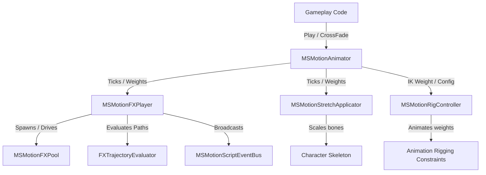

# MSMotion Runtime System

**MaharajaStudio MSMotion** features a high-performance, modular runtime framework designed to drive characters using Unity's modern **PlayableGraph API**. By bypassing the rigid, memory-heavy Mecanim state machine controller model, MSMotion provides developers with direct, code-driven control over skeletal animation, visual and audio effects execution, Inverse Kinematics (IK), and real-time bone-stretching calculations.

---

## Why MSMotion Runtime Matters

For studios and developers building performance-critical projects, the MSMotion runtime provides clear, production-tested advantages:

*   **Zero GC Allocations on Hot Paths**: Once initialized, all play, crossfade, and event tick operations run entirely allocation-free to prevent frame-rate stuttering and GC spikes.
*   **On-Demand Layer Management**: Mixers and playable inputs are allocated dynamically as animations play, ensuring minimal memory footprint for characters with large asset pools.
*   **Decoupled Procedural Solvers**: FX spawning, rigging constraints, and bone scaling are split into clean, modular components that run in a single coordinate-compensated LateUpdate tick.
*   **Designer-Authored, Code-Driven**: Designers use visual editor tools to package clips, overrides, events, and IK parameters into unified `MSMotionAnimationConfig` assets. Programmers play them with a single, clear line of C#.

---

## System Architecture

The runtime framework is divided into dedicated managers that run alongside the standard Unity `Animator`. When multiple components are present on the same GameObject, they coordinate automatically.

### Core Components

1.  **[MSMotionAnimator](core-animation-system.md)**: The central driver. It manages the core `PlayableGraph`, handles blending layers, and triggers fades and crossfades.
2.  **[MSMotionFXPlayer](fx-event-system.md)**: Listens to the timeline playhead and schedules visual effects, particles, sound, camera shakes, and custom script callbacks.
3.  **[MSMotionRigController](rigging-and-ik-system.md)**: Interfaces with Unity's Animation Rigging constraints, enabling dynamic procedural aiming, foot planting, and bone offsets.
4.  **[MSMotionStretchApplicator](stretch-and-scale-system.md)**: Applies procedural Squash & Stretch overrides directly to bones using baked keyframe curves.

---

## Package Integration & Requirements

The runtime framework relies on the following configurations:

*   **Namespace**: `MaharajaStudio.MSMotion.Runtime`
*   **Assembly Definition**: `MaharajaStudio.MSMotion.Runtime.asmdef`

### Dependency Compatibility

The runtime is designed to automatically compile and scale its capabilities depending on what packages are present in your project:

| Package Dependency | Minimum Version | Feature Enabled | Script Define Symbol |
| :--- | :--- | :--- | :--- |
| **Core Unity Engine** | 2021.3 LTS+ | Base PlayableGraph playback | *Always Enabled* |
| **Animation Rigging** (`com.unity.animation.rigging`) | 1.2.0 | IK constraints, custom solvers | `MSMOTION_ANIMATION_RIGGING` |
| **Cinemachine** (`com.unity.cinemachine`) | 3.0.0 | Dynamic camera shake impulses | `MSMOTION_CINEMACHINE` |
| **Visual Effect Graph** (`com.unity.visualeffectgraph`) | 12.0.0 | High-performance GPU particles | `MSMOTION_VFX_GRAPH` |

---

## Installation

MSMotion's runtime framework compiles inside your standard Unity package hierarchy:

1.  Open your project in **Unity 2021.3 LTS** or newer.
2.  Import the package:
    *   **UPM (recommended)**: Add the package via git URL or from disk using the Unity Package Manager window.
    *   **Unity Package**: Double-click the downloaded `.unitypackage` asset.
3.  Click **Import** on the pop-up dialogue. All runtime scripts are compiled into `Assets/com.maharajastudio.animation-editor/Runtime/` (or package folder).
4.  The editor will compile and automatically define compile-time symbols based on your project's active packages.

---

## Runtime Documentation Guides

Navigate the runtime architecture and API reference using the following chapters:

*   **[Quick Start Guide](quick-start.md)**: Build a simple character controller and play your first config in under 5 minutes.
*   **[Core Animation System](core-animation-system.md)**: Learn how `MSMotionAnimator` manages playable graphs, layers, and crossfading transitions.
*   **[FX & Event System](fx-event-system.md)**: Harness character effects, trajectories, global registries, and script event buses.
*   **[Rigging & IK System](rigging-and-ik-system.md)**: Integrate character IK constraints, set targets at runtime, and manage cross-layer suppression.
*   **[Stretch & Scale System](stretch-and-scale-system.md)**: Enable squash-and-stretch capabilities, and configure Level-of-Detail (LOD) distance culling.
*   **[Optimization & Best Practices](optimization-and-best-practices.md)**: Guidelines for allocation-free systems, multi-threaded considerations, and performance-tuning.
